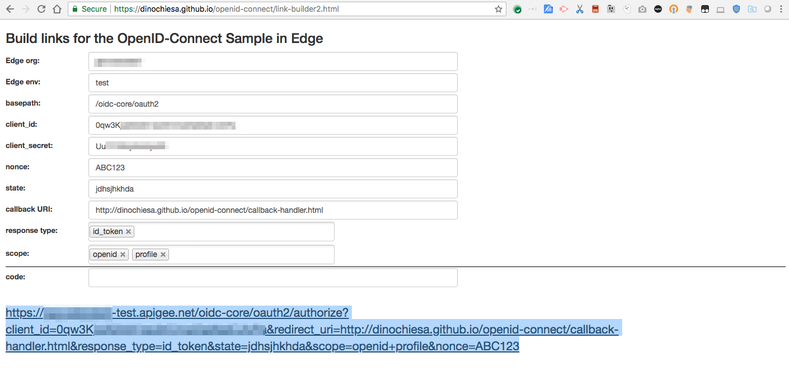
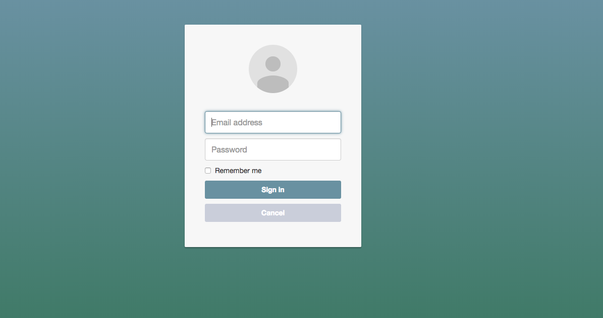
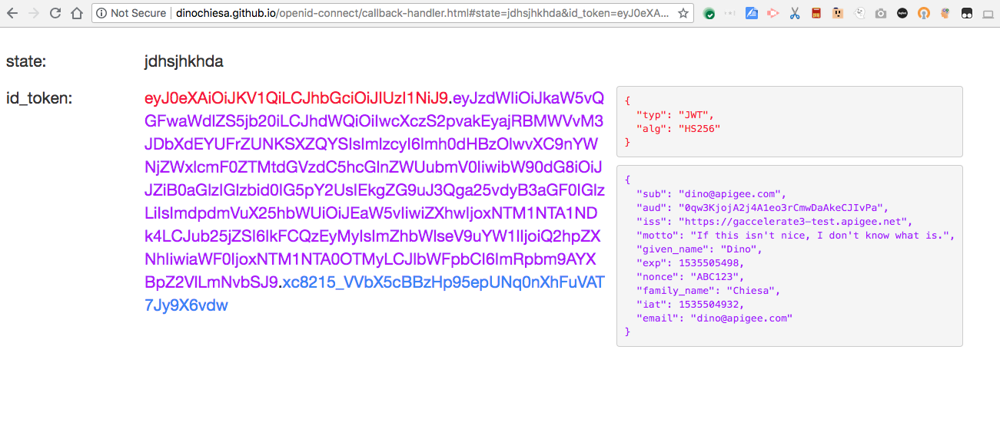

## OpenID Connect setup

OpenID Connect adds an Authentication mechanism to OAuth 2.0.

This repository includes proxies and tools to demonstrate how that would work with Apigee Edge.

There are 3 pieces you need to run this demonstration:
* The Edge proxies - there are 2: oidc-core and oidc-session
* The login-and-consent application, which is a web app
* a web browser


In this demonstration, we do not provide the client app. Just for this demo, the client
app is something you imagine.

In a real use of OpenID Connect, there would be an actual client app, and the client
would send the GET request to kick off the OIDC authentication and consent. In this
demonstration we will use the browser to GET the URL to kick off the OIDC flow. This
simulates the client app behavior.

## Disclaimer

This example is not an official Google product, nor is it part of an official Google product.

## License

All of the code here is Copyright (c) 2016 Apigee Corporation and Copyright 2018 (c) Google LLC is licensed under the [Apache 2.0 Source license](LICENSE).

## Demo Walkthrough

[](https://youtu.be/hJNGu0RFzzc "OIDC Demo Walkthrough")

## Setting it Up

You can set up this demonstration in your organization, following these steps:

1. create a cache in Edge called 'cache1' in your desired deployment environment.
   ```
   ORG=myorg
   ENV=myenv
   cd tools
   APIGEEADMIN=apigeeadmin@example.com
   node ./1-provisionCache.js -v -u $APIGEEADMIN -o $ORG -e $ENV
   ```

   For this script and all following, you can use -n, in lieu of -u $APIGEEADMIN, to
   tell the script to source your credentials from the .netrc file.

2. deploy the proxies to an edge org + env
   ```
   node ./2-importAndDeployAllProxies.js -v -u $APIGEEADMIN -o $ORG -e $ENV
   ```

3. provision the OIDC Session product and developer app.
   ```
   node ./3-provisionSessionProductAndApp.js -v -u $APIGEEADMIN -o $ORG
   ```
   This will run for a minute or so, and then emit an API Key for the Session API.  You'll use it in the next step.

4. Modify the [config for the login-and-consent app](consent-ui-webapp/config/config.json)
   to specify the API Key for the Session API.  It should look like this:
   ```
   {
     "sessionApi" : {
       "apikey" : "YOUR_API_KEY_HERE"
     },
     "localUserDb" : "../config/localUserDb.js",
     "authSystem" : "local"
   }
   ```

5. deploy the login-and-consent webapp to a location that is reachable from the internet, like Google App Engine.

6. in Edge, create the developer, API Product, and App for OIDC Core use.
   ```
   node ./4-provisionCoreProductAndApp.js -v -u $APIGEEADMIN -o $ORG -U URL_FROM_ABOVE
   ```

   The URL_FROM_ABOVE should be the /login endpoint for the login and consent app.

7. Kick off the login by opening your browser to
   [link-builder](https://dinochiesa.github.io/openid-connect/link-builder2.html) and filling out the
   form. Specify your org, env, the client id and secret from the final
   step, a nonce and state, the callback url from above, and etc. For example:

   | setting       | value                                                            |
   | ------------- | ---------------------------------------------------------------- |
   | basepath      | /oidc-core/oauth2                                                |
   | callback URI  | http://dinochiesa.github.io/openid-connect/callback-handler.html |
   | response type | id_token                                                         |
   | scope         | openid profile                                                   |


## Notes on Using the Link Builder

The link builder is just a webform that helps you build the link to kick off the OIDC
flow. Fill out all the fields, with the data from your configuration. It uses
localStorage to retain that information for next time.

When you fill out the form, the hyperlink at the bottom is dynamically updated.



I suggest you alt-click the link when you're ready, so the login page appears in a new
browser window. The login page looks like this:



You can read more details about the [Consent UI](./Consent-UI.md).

If you have an authorization_code flow (response_type=code), after you login and
consent, you will get a code. Copy the code, then return to the link-builder
page. Paste the code into the form at the bottom.  The very bottom of the page will show
a curl command that will redeem the code for an oauth token. Click the "copy" button and
run that curl command from the terminal to retrieve the token.

If you use response_type=id_token, you will get a token directly. The page will show the decoded token.
This is the token the client app would receive after an OpenID Connect authentication motion.

The decoded token looks like this:




## Possible Tweaks or Modifications

* modify the basepath in the API proxies called 'oidc-core' and 'oidc-session'. Why you
  would care to do this, I'm not sure.  If you do it, you'll need to redploy everything
  and modify the configuration for the login-and-consent app to be consistent.

* modify the config for the login-and-consent app to specify a different authentication
  service to use. 'local' is easiest. (See the [Readme for the consent
  webapp](./Consent-UI.md).


## Some Remarks on ID Tokens

JWT are tokens, that are formatted as JSON and then potentially signed. With respect to
OpenID Connect, JWT are used to represent identification information about a subject, so
they're called "id tokens", aka id_tokens.

JWT can be:
* unsigned. Really this is just a JSON payload. In which case they ought to be untrusted.
* signed with a private key. (RSA-256) These can be verified with the corresponding public key.
* signed with a secret key, via HMAC-256.  These can be verified with the secret key.

This demonstration issues JWT that are signed with a secret key. The key used is the
client_secret from the developer app in Apigee Edge - this is a secret shared between
the app and the JWT issuer (Edge).

You could modify the API Proxy to generate JWT signed with a private key. To do that
you'd need to introduce key management or a public/private keypair into the system. Not
a huge effort, but this demo does not do it.


## Other Info

There are 4 proxies in this package.

* *oidc-core* - Core OpenID Connect capability
* *oidc-discovery* - Supporting the Discovery part of OpenID Connect
* *oidc-userinfo* - Supporting the Userinfo part of OpenID Connect
* *oidc-session* - Custom stuff, outside the spec of OIDC, supporting the login app.

If you want to demonstrate only token or code issuance (including JWT issuance) via
OIDC, then you need only the core and session proxies. This demonstration does not
illustrate the userinfo or discovery pieces of OIDC.

# Bugs

* The JWT construction does not use the built-in policies.
